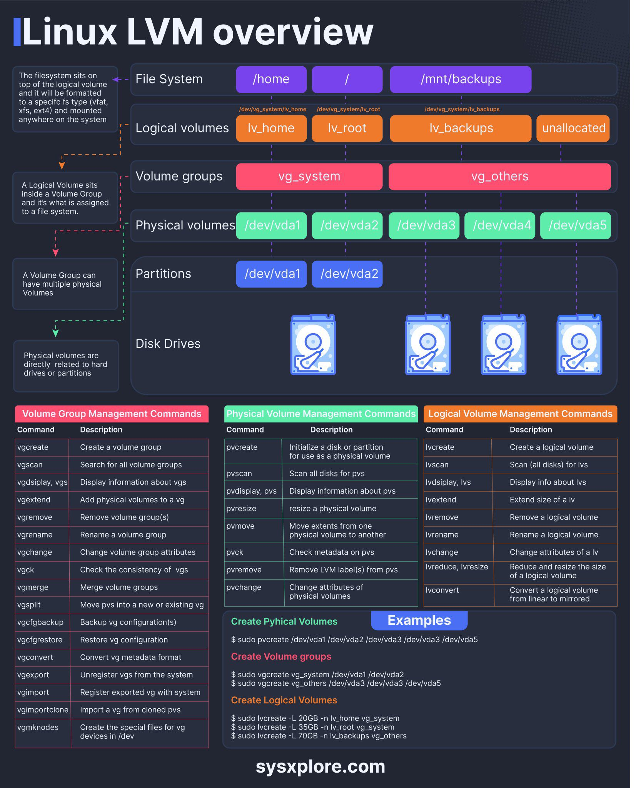

# 1. Gün: İleri Dosya Sistemi ve Depolama Yönetimi

Bu ders, ileri düzey dosya sistemi yönetimi, yedekleme, RAID ve LVM yapılandırmaları, dosya sistemi bütünlüğünü koruma ve disk/depolama yönetimi konularını kapsamaktadır. Linux sistemlerinde depolama yönetiminin temel prensiplerini öğrenerek veri güvenliği ve sistem performansını artırmak amaçlanmaktadır.

---

## İçindekiler
1. [Dosya Sistemleri: ext4, XFS](#dosya-sistemleri-ext4-xfs)
2. [Dosya Sistemlerinin Yedeklenmesi ve Kurtarılması](#dosya-sistemlerinin-yedeklenmesi-ve-kurtarılması)
3. [RAID ve LVM Yapılandırması](#raid-ve-lvm-yapılandırması)
4. [Dosya Sistemi Bütünlüğünü Koruma](#dosya-sistemi-bütünlüğünü-koruma)
5. [Disk/Depolama Yönetimi](#diskdepolama-yönetimi)

---

### 1. Dosya Sistemleri: ext4, XFS

- **ext4** ve **XFS** dosya sistemleri, Linux'ta yaygın olarak kullanılan modern dosya sistemleridir. 
- **ext4**: Yaygın olarak kullanılan ve yüksek performans sunan bir dosya sistemidir. Büyük dosyaları destekler ve veri bütünlüğünü sağlar.
- **XFS**: Büyük veri işleme ve yüksek performans gerektiren sistemlerde kullanılır. Yüksek ölçeklenebilirlik ve performans sağlar.

#### Uygulama:
- **ext4** dosya sistemini oluşturma ve bağlama:
  ```bash
  # ext4 dosya sistemi oluşturma
  mkfs.ext4 /dev/sdX
  
  # Dosya sistemini bağlama
  mount /dev/sdX /mnt
  ```
- **XFS** dosya sistemini oluşturma ve bağlama:
  ```bash
  # XFS dosya sistemi oluşturma
  mkfs.xfs /dev/sdX
  
  # Dosya sistemini bağlama
  mount /dev/sdX /mnt
  ```

---

### 2. Dosya Sistemlerinin Yedeklenmesi ve Kurtarılması

- **Yedekleme araçları**:
  - **`rsync`**: Dosya ve dizinleri yedeklemek için kullanılır.
  - **`tar`**: Dosya ve dizinleri sıkıştırılmış bir arşiv dosyasına almak için kullanılır.
  - **`dd`**: Bir diskin veya bölümün tam kopyasını almak için kullanılır.

#### Uygulama:
- `rsync` ile yedekleme:
  ```bash
  # /home dizinini /backup dizinine yedekleme
  rsync -av /home /backup
  ```

- `tar` ile yedekleme:
  ```bash
  # /home dizinini sıkıştırılmış yedekleme dosyasına almak
  tar -cvpzf /backup/home_backup.tar.gz /home
  ```

- `dd` ile yedekleme:
  ```bash
  # Bir disk bölümü yedeği oluşturma
  dd if=/dev/sdX of=/backup/disk_image.img
  ```

- **Kurtarma işlemi**:
  ```bash
  # tar ile yedek dosyasını geri yükleme
  tar -xvpzf /backup/home_backup.tar.gz -C /
  ```

---

### 3. RAID ve LVM Yapılandırması

- **RAID (Redundant Array of Independent Disks)**: Birden çok disk kullanarak veri güvenliğini artırma veya performansı iyileştirme yöntemi.
  - **RAID 0**: Performans artırır, ancak veri yedeklemesi sağlamaz.
  - **RAID 1**: Veriyi iki disk üzerinde yansıtır ve güvenlik sağlar.
  - **RAID 5**: Minimum 3 disk ile veri güvenliği ve performans sağlar.
  
- **LVM (Logical Volume Manager)**: Disk alanlarını mantıksal hacimlerde birleştirerek daha esnek bir depolama yönetimi sağlar.

#### Uygulama:
- RAID 1 yapılandırması:
  ```bash
  # RAID 1 yapılandırması için iki diski birleştirme
  mdadm --create --verbose /dev/md0 --level=1 --raid-devices=2 /dev/sdX /dev/sdY
  ```

- LVM yapılandırması:
  ```bash
  # Fiziksel hacim oluşturma
  pvcreate /dev/sdX
  
  # Hacim grubu oluşturma
  vgcreate hacimGrubu /dev/sdX
  
  # Mantıksal hacim oluşturma
  lvcreate -L 10G -n mantiksalHacim hacimGrubu
  ```

---

### 4. Dosya Sistemi Bütünlüğünü Koruma

- **Dosya sistemi bütünlüğü**: Dosya sisteminin sağlam kalmasını sağlamak için düzenli olarak kontrol edilmesi gereklidir.
- **Araçlar**:
  - **`fsck`**: Dosya sistemi hatalarını kontrol eder ve onarır.
  - **`smartctl`**: Disk sağlığını izlemek için kullanılır.

#### Uygulama:
- `fsck` kullanarak dosya sistemi kontrolü:
  ```bash
  # /dev/sdX dosya sistemini kontrol etme
  fsck /dev/sdX
  ```

- `smartctl` kullanarak disk sağlığını kontrol etme:
  ```bash
  # /dev/sdX diskinin durumunu kontrol etme
  smartctl -H /dev/sdX
  ```

---

### 5. Disk/Depolama Yönetimi

- **Depolama Yönetimi**: Diskler üzerinde bölümler oluşturma, silme, erişim izinlerini ayarlama işlemlerini içerir.

#### Uygulama:
- Disk bölümü oluşturma ve biçimlendirme:
  ```bash
  # Yeni bir disk bölümü oluşturma
  fdisk /dev/sdX
  
  # Disk bölümünü biçimlendirme (ext4)
  mkfs.ext4 /dev/sdX1
  ```

- **Erişim izinlerini ayarlama**:
  ```bash
  # Diskin sadece root kullanıcıya erişim izni vermek
  chmod 600 /dev/sdX
  ```

- LVM mantıksal hacimlerini yönetme:
  ```bash
  # Mantıksal hacmi genişletme
  lvextend -L +5G /dev/hacimGrubu/mantiksalHacim
  
  # Dosya sistemini yeni boyuta göre genişletme (ext4 için)
  resize2fs /dev/hacimGrubu/mantiksalHacim
  ```

--

 
 
--

## Özet

Bu bölümde, Linux sistemlerinde kullanılan dosya sistemleri (ext4 ve XFS), yedekleme yöntemleri, RAID ve LVM yapılandırmaları ve dosya sistemi bütünlüğünü koruma konuları ele alınmıştır. Ayrıca, depolama aygıtlarının yönetimi, disk bölümleri ve erişim izinleri hakkında uygulamalı bilgiler sunulmuştur.

---

## Ek Kaynaklar
- [Linux Dosya Sistemleri Hakkında Daha Fazla Bilgi](https://wiki.archlinux.org/title/File_systems)
- [RAID Yapılandırmaları](https://en.wikipedia.org/wiki/RAID)
- [LVM Yönetimi](https://wiki.ubuntu.com/Lvm)

